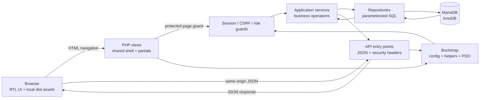
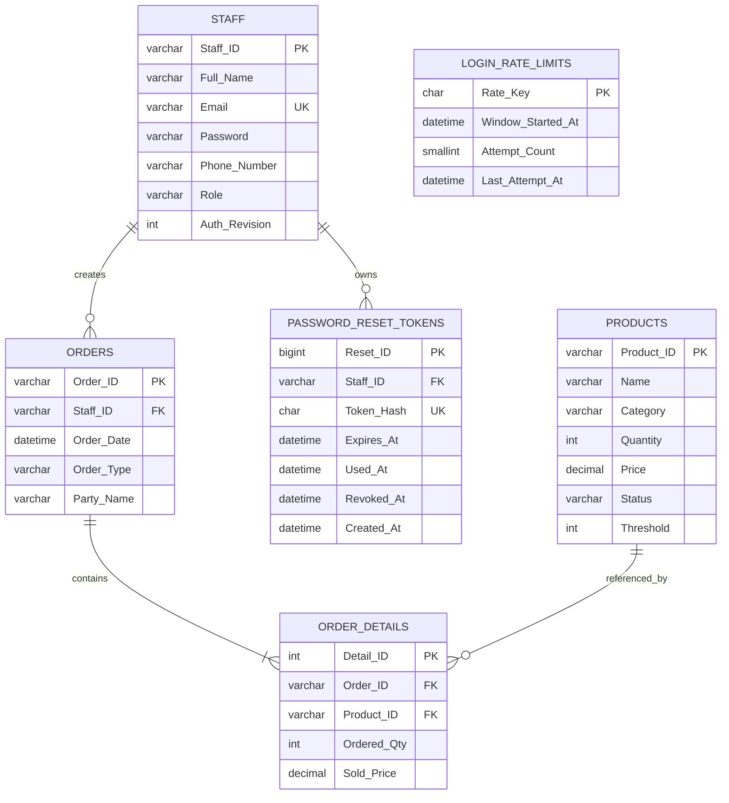

# QuickMart IOMS

## Engineering README

QuickMart IOMS is a server-rendered inventory and order-management system for
retail operations. It is implemented with PHP, MariaDB, PDO, vanilla
JavaScript, CSS, and Apache.

This document describes the system as it exists in the repository. It is an
engineering handoff document, not a product brochure. The backend is the
authority for authentication, authorization, inventory, prices, totals, order
history, and role policy. The browser is responsible for presentation and user
interaction only.

## Engineering stance

- Preserve backend authority. The client must not derive or override prices,
  totals, stock, order IDs, roles, or account state.
- Keep business rules in application services, repositories, and the database;
  PHP views compose presentation only.
- Prefer explicit validation, transactions, prepared statements, and clear
  failure handling over implicit framework behavior.
- Keep the current procedural/global PHP architecture compatible. Composer is a
  small bootstrap aid, not a reason to perform an unreviewed namespace
  migration.
- Use isolated databases for destructive verification. Do not use the runtime
  database as a test fixture.

The UI is an RTL-first operations console with Arabic-friendly typography,
explicit inventory states, and responsive layouts. Visual design is subordinate
to operational clarity and accessibility.

## Current capabilities

- Product catalog and inventory tracking with normal, low-stock, and out-of-stock states.
- Sell orders with transactional stock deduction and insufficient-stock protection.
- Purchase orders with transactional stock replenishment.
- Historical order details using the price stored at the time of the order.
- Role-based access for `Admin`, `Manager`, and `Staff`.
- Admin-only staff management and reporting.
- Authenticated user profile and password management.
- Dashboard inventory health, recent orders, order details, and report summaries.
- CSRF protection, password hashing, prepared SQL statements, foreign-key integrity, and session revalidation.

Admin-only staff creation is available through the Staff Create API. The staff-management contract also supports listing, viewing, updating, deleting, profile updates, and password changes.

## Technology stack

- PHP 8.0+
- MariaDB 10.4+ with InnoDB transactions
- PDO for database access
- Vanilla JavaScript and CSS
- Apache through XAMPP or an equivalent PHP web-server setup
- Composer 2 for generating the production autoload metadata
- Node.js/npm for reproducible production CSS and JavaScript builds; runtime Bootstrap and Poppins assets are self-hosted

## Runtime architecture

The application has three deliberate boundaries:

1. PHP views render protected screens and load the shared shell.
2. JSON API entry points authenticate and validate requests before invoking
   application services.
3. Repositories are the database boundary. MariaDB constraints and
   transactions protect inventory and historical order data.

### Diagram 1: request and execution path



`backend/bootstrap.php` loads the optional Composer autoloader and then the
legacy configuration and helper files in deterministic order. API entry points
continue through `backend/api/bootstrap.php`, which adds the database handle,
JSON content type, and baseline security headers. Existing view entry points
retain their protected-view include conventions.

The frontend uses the shared `apiFetch` boundary and server-authoritative
session probing. `sessionStorage` can cache display hints after a successful
probe, but it never grants authentication or role access.

## Project structure

```text
QuickMart-IOMS-main/
├── assets/
│   ├── common.css              # Shared design tokens and application shell
│   ├── common.js               # Shared frontend utilities and apiFetch
│   ├── dashboard/              # Dashboard styles and behavior
│   ├── products/               # Product page styles and behavior
│   ├── orders/                 # Order list and creation behavior
│   ├── create-order/           # Order creation assets
│   ├── order-details/          # Order detail assets
│   ├── reports/                # Reporting assets
│   ├── staff/                  # Staff management assets
│   ├── profile/                # Profile assets
│   ├── fonts/                  # Self-hosted Poppins subsets and license
│   ├── vendor/bootstrap/       # Bootstrap 5.3.0 local CSS/JS bundle
│   └── login-signup/           # Login assets
├── dist/css/                   # Generated production CSS
├── dist/js/                    # Generated production JavaScript
├── scripts/build-css.js        # Reproducible CSS minification entrypoint
├── scripts/build-js.js         # Reproducible JavaScript minification entrypoint
├── backend/
│   ├── bootstrap.php             # Composer-aware application bootstrap with local fallback
│   ├── api/                    # JSON API endpoints
│   ├── application/            # Application services
│   ├── core/                   # Configuration, database, auth, and helpers
│   ├── infrastructure/        # Repository implementations
│   └── views/                  # Protected PHP views and shared shell partials
├── database/
│   ├── schema.sql              # Current baseline schema
│   ├── data.sql                # Optional disposable demo data
│   └── migrations/             # Incremental migrations 001 through 006
├── .env.example               # Environment variable names only
├── composer.json                # PHP requirement and narrow legacy classmap
├── package.json                # Pinned frontend build tool
├── package-lock.json           # npm dependency lockfile
├── index.php                  # Application entry point
└── README.md
```

## Local setup with XAMPP

### Prerequisites

- XAMPP or an equivalent Apache/PHP/MariaDB environment.
- PHP 8.0 or newer.
- MariaDB 10.4 or newer.
- A modern browser.

### 1. Clone the repository

```bash
git clone https://github.com/mohammad-emad-dev/QuickMart-IOMS.git
```

For the default Windows XAMPP layout, place the project at:

```text
C:\xampp\htdocs\QuickMart-IOMS-main
```

### 2. Generate the Composer autoloader

The application has no third-party Composer dependency. For staging and production, generate the optimized autoloader from the repository root and do not commit the generated `vendor/` directory:

```powershell
composer install --no-dev --optimize-autoloader
```

All PHP entrypoints converge on `backend/bootstrap.php`. It loads `vendor/autoload.php` when present and otherwise uses the verified procedural fallback, which keeps local XAMPP development working without Composer. The current codebase remains global/procedural; no PSR-4 namespace migration is implied.

### 3. Build the frontend assets

From the repository root, install the pinned build tools and regenerate the
production CSS and JavaScript before serving the application:

```text
npm ci
npm run build
```

Readable CSS and JavaScript remain under `assets/`; the PHP views and login
page load generated `dist/css/*.min.css` and `dist/js/*.min.js` files.
Bootstrap `5.3.0`, the Poppins Latin weights used by Create Order, and the
project JavaScript outputs are local, so reviewed pages do not depend on a CDN
at runtime. See
[docs/FRONTEND-BUILD.md](docs/FRONTEND-BUILD.md) for asset ownership and font
license details.

### 4. Configure the database connection

The application does not read a `.env` file. Configure these variables through Apache `SetEnv`, Windows environment variables, or the PHP runtime. Use `.env.example` as the variable-name reference:

```text
QUICKMART_DB_HOST
QUICKMART_DB_NAME
QUICKMART_DB_USER
QUICKMART_DB_PASSWORD
QUICKMART_ALLOWED_ORIGIN
QUICKMART_RATE_LIMIT_SECRET
```

`QUICKMART_RATE_LIMIT_SECRET` is optional for local development and should be a high-entropy deployment secret in production. It protects the one-way login limiter keys from offline correlation. Never commit a real password or other secret. `QUICKMART_ALLOWED_ORIGIN` may remain empty for a same-origin local deployment.

### 4. Create the database

Import the current baseline schema into a disposable local database:

```sql
SOURCE /path/to/QuickMart-IOMS-main/database/schema.sql;
```

Optional demo data can be imported afterward:

```sql
SOURCE /path/to/QuickMart-IOMS-main/database/data.sql;
```

The demo data is for local testing only. Rotate or replace seeded credentials before using the application in any shared environment.

For an existing database that predates the current baseline, review and apply migrations `001` through `006` in order using the project’s migration process. Migration `006` creates the persistent login-attempt limiter table. Do not apply migrations blindly to a production database.

### 5. Backup and restore

Create a logical backup before applying migrations or deploying. Use a least-privilege database account for shared or production environments and keep the dump outside the repository:

```powershell
mysqldump -u <database_user> -p quickmart_db > quickmart_db_backup.sql
```

Restore only to a verified target, preferably a disposable database first:

```powershell
mysql -u <database_user> -p quickmart_db < quickmart_db_backup.sql
```

Pause writes during a production restore, verify foreign keys and row counts afterward, and never commit backup files or database credentials. The tracked `.htaccess` database fallback is for local XAMPP review only; production deployments must provide the `QUICKMART_*` values through server environment configuration.

### 6. Start the application

Start Apache and MariaDB from the XAMPP Control Panel, then open:

```text
http://localhost/QuickMart-IOMS-main/
```

Useful direct review pages include:

```text
http://localhost/QuickMart-IOMS-main/assets/login-signup/login.html
http://localhost/QuickMart-IOMS-main/backend/views/dashboard.php
```

Default account credentials are intentionally not documented. Use disposable local seed data or provision accounts through an approved administrative process.

For the complete staging and production handoff runbook, see [docs/PRODUCTION-HANDOFF.md](docs/PRODUCTION-HANDOFF.md).

## Roles and access

The database accepts exactly these roles:

| Role | Access summary |
| --- | --- |
| `Admin` | Full administrative access, staff management, all orders, and reports. |
| `Manager` | Authenticated operational access permitted by each endpoint; no Admin-only staff or report access. |
| `Staff` | Authenticated operational access permitted by each endpoint, including own profile/password and owned orders; no Admin-only staff or report access. |

The backend is authoritative for authorization. Client-side role hints are used only to shape the interface and never grant access.

## API surface

All API responses use the project’s JSON response helpers and the existing `{ "success": true, "data": ... }` success shape where applicable.

### Authentication

| Method | Endpoint | Purpose |
| --- | --- | --- |
| `POST` | `backend/api/auth/login.php` | Authenticate a staff member. |
| `POST` | `backend/api/auth/logout.php` | End the current session. |
| `GET` | `backend/api/auth/csrf.php` | Return the authenticated session CSRF token. |
| `GET` | `backend/api/auth/session.php` | Revalidate the server-side session and return safe UI identity data. |
| `POST` | `backend/api/auth/forgot_password.php` | Intentionally disabled with HTTP 503 until secure delivery is available. |

### Products

| Method | Endpoint | Purpose |
| --- | --- | --- |
| `GET` | `backend/api/products/list.php` | List products. |
| `GET` | `backend/api/products/get.php?id=...` | Read one product. |
| `POST` | `backend/api/products/create.php` | Create a product where authorized. |
| `PUT` | `backend/api/products/update.php` | Update a product where authorized. |
| `DELETE` | `backend/api/products/delete.php` | Delete a product where authorized. |

### Orders

| Method | Endpoint | Purpose |
| --- | --- | --- |
| `GET` | `backend/api/orders/list.php` | List authorized orders with existing filters. |
| `GET` | `backend/api/orders/get.php?id=...` | Read an authorized order and its stored detail prices. |
| `POST` | `backend/api/orders/create.php` | Create a sell or purchase order transactionally. |

### Staff

| Method | Endpoint | Purpose |
| --- | --- | --- |
| `GET` | `backend/api/staff/list.php` | Admin-only staff list. |
| `GET` | `backend/api/staff/get.php?id=...` | Read a permitted staff record. |
| `POST` | `backend/api/staff/create.php` | Admin-only creation of a staff account with an initial password. |
| `POST` | `backend/api/staff/update.php` | Admin-only staff update. |
| `POST` | `backend/api/staff/delete.php` | Admin-only staff deletion with order-history protection. |
| `POST` | `backend/api/staff/update-profile.php` | Update the authenticated user’s profile. |
| `POST` | `backend/api/staff/change-password.php` | Change the authenticated user’s password. |

### Reports

| Method | Endpoint | Purpose |
| --- | --- | --- |
| `GET` | `backend/api/reports/stats.php` | Admin-only dashboard and reporting metrics. |

## Database and migration notes

The database is MariaDB using InnoDB. Referential integrity, check constraints,
unique keys, row locks, and transactions are part of the application contract.

### Diagram 2: relational model



`LOGIN_RATE_LIMITS` is intentionally independent of `STAFF`: it must also
handle unknown identifiers without exposing account existence.

The current schema includes:

- `Staff` with canonical roles and `Auth_Revision` for future session invalidation.
- `Products` with stock, price, threshold, and status constraints.
- `Orders` and `Order_Details` with restricted history-preserving foreign keys.
- `Login_Rate_Limits` with bounded, one-way identifier/client buckets for concurrent login throttling.
- `Password_Reset_Tokens` storing only case-sensitive SHA-256 token hashes, with expiry, use, revocation, and cleanup indexes.

Data integrity rules that should not be moved into the browser:

- `Order_Details.Sold_Price` is the historical unit price. Order history does
  not recalculate from the current product price.
- Sell and Purchase operations update stock inside a transaction. Insufficient
  stock, missing products, duplicate order IDs, and transaction failures must
  leave no partial order or stock mutation.
- Foreign keys use restrictive deletion for products, orders, and order staff
  references so historical records remain valid.
- `Staff.Email` is unique. Roles are constrained to `Admin`, `Manager`, and
  `Staff`; `Auth_Revision` starts at 1 and invalidates stale sessions.
- Product quantity, price, status, and threshold constraints are enforced in
  the schema as well as at the application boundary.
- `database/schema.sql` is a fresh-install baseline and drops existing tables.
  Use it only for an empty or disposable database. Existing databases require
  migrations `001` through `006` in order.

The public password-reset request remains disabled because no secure email or
token-delivery provider is configured. The internal token lifecycle must not be
treated as a user-facing recovery flow until delivery and global session
invalidation requirements are completed. Login attempts are limited to five
valid-shaped attempts per identifier/client bucket in a 15-minute window; the
sixth receives HTTP 429 with `Retry-After`, and a successful login clears the
bucket.

## Security notes

Security is enforced in layers. The browser can improve usability and explain
state, but it cannot make an unauthorized request valid. Each API boundary
repeats the checks needed for its operation, and database constraints provide
the final integrity boundary.

- Passwords are stored as password hashes and are never returned by the APIs.
- Reset-token records contain hashes only; raw tokens, reset URLs, and credentials are not persisted or logged.
- PDO prepared statements and repository boundaries protect database operations from SQL injection.
- CSRF validation protects authenticated mutations.
- Session cookies use the project’s secure session settings, and protected requests revalidate the current staff record and role.
- `Auth_Revision` invalidates stale sessions after password-sensitive changes without deleting arbitrary PHP session files.
- The authenticated session probe is server-authoritative; sessionStorage is only a UI cache and never grants access.
- HTML authorization failures use a styled shared page, while API authorization failures remain JSON.
- Login rate-limit keys use normalized identifiers plus `REMOTE_ADDR`; forwarded proxy headers are not trusted by default.
- Orders use transactions and row locking for stock changes.
- Foreign keys preserve order history and protect referenced products and staff records.

## Dependency management and autoloading

`composer.json` requires PHP `>=8.0` and intentionally declares no third-party packages. Its narrow classmap covers the one global `OrderIdConflictException` class in `backend/application/orders/order-service.php`; no unsafe PSR-4 mapping is used for the procedural function files. `backend/bootstrap.php` optionally loads Composer's generated `vendor/autoload.php`, then loads the legacy config/helpers in deterministic order. Future namespaced code may add a PSR-4 mapping only after the relevant files are migrated and reviewed.

## Code quality and maintainability

The repository intentionally uses a transitional procedural PHP architecture.
It is not a framework application and does not claim a complete PSR-4
namespace migration.

Quality rules for changes:

- Keep SQL out of views and keep authorization decisions on the server.
- Keep request validation separate from output encoding.
- Use explicit service/repository boundaries and parameterized SQL.
- Preserve existing API status codes and response shapes unless a security
  change explicitly documents a new status such as 429.
- Use `textContent` and DOM APIs for dynamic browser rendering; do not
  introduce unsafe API-data interpolation into `innerHTML`.
- Preserve numeric and currency values as LTR content inside the RTL interface.
- Keep shared shell markup in partials and preserve JavaScript IDs, data
  attributes, ARIA relationships, and script order.
- Do not put passwords, reset tokens, database credentials, or session secrets
  into logs, fixtures, screenshots, URLs, or browser storage.
- Test failure paths, not only successful requests: 401, 403, 409, 422, 429,
  503, database failure, stale session, empty data, rollback, and retry.

### Source and generated assets

Readable CSS and JavaScript under `assets/` are the source of truth. Runtime
pages load generated files under `dist/`. The build is reproducible and is not
an excuse to edit generated output by hand:

```bash
npm ci
npm run build
```

The build uses pinned `clean-css` and `terser` development tools. Terser keeps
top-level names stable because shared helpers and callbacks cross page-script
boundaries. Bootstrap 5.3.0 and the Poppins font files are self-hosted. See
[docs/FRONTEND-BUILD.md](docs/FRONTEND-BUILD.md) for ownership and licensing.

### Change review expectations

For a non-trivial change, review the actual diff and verify:

1. API payloads, response envelopes, authorization, and session behavior are
   unchanged unless the change explicitly requires otherwise.
2. Database writes are transactional and recover cleanly on validation,
   conflict, deadlock, and unexpected database errors.
3. Dynamic HTML output is contextually escaped or rendered with safe DOM APIs.
4. Existing selectors, partial include paths, print rules, and responsive
   states remain compatible.
5. Temporary databases, rows, users, sessions, browser profiles, screenshots,
   and scripts are removed after verification.

## Development checks

Run PHP lint with the project PHP executable:

```powershell
C:\xampp\php\php.exe -l backend\views\dashboard.php
```

Run JavaScript syntax checks with Node.js:

```powershell
node --check assets\dashboard\dashboard.js
```

For broader changes, lint all affected PHP and JavaScript files and perform browser smoke testing against an isolated database. Do not use the live runtime database for destructive verification.

## Known engineering limitations

- Public password reset is intentionally disabled because no approved email or
  SMS delivery provider is configured. Enabling it requires a real provider,
  deployment secrets, HTTPS, request throttling, audit behavior, and session
  invalidation verification.
- Actual domain and HTTPS deployment are outside the local XAMPP workspace.
- Production credentials and the least-privilege database account must be
  supplied by the deployment owner.
- Composer remains a transitional bootstrap layer; the PHP codebase is still
  primarily procedural/global and is not a full PSR-4 application.
- The repository currently relies on lint, build, isolated-database, API, and
  Edge/CDP smoke verification rather than a dedicated unit/integration test
  framework.
- `STATUS.md` records a pre-existing local runtime-data provenance discrepancy.
  Reconcile the runtime database with an authoritative backup before treating
  the project as production-ready.

## License

No license file is currently included in the repository. Confirm licensing before redistributing or deploying the project outside its intended environment.
